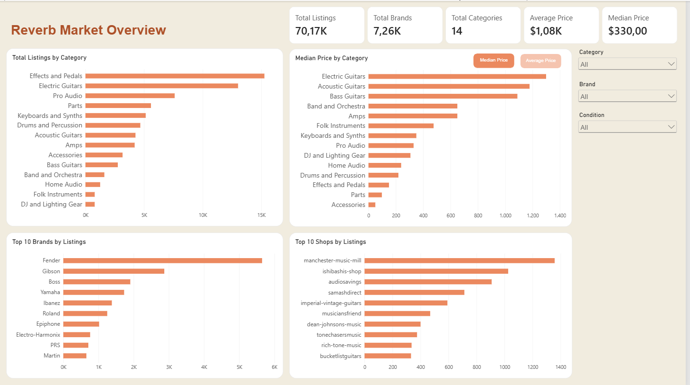
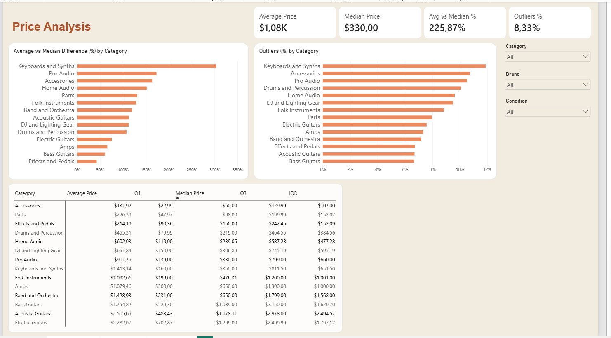
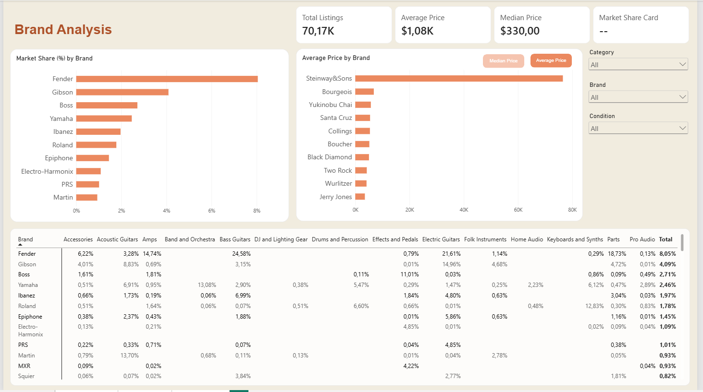

# Reverb Listings — Marketplace Data Analysis

An end-to-end data analytics project that extracts marketplace listings from the Reverb API, processes and validates the data with Python, loads it into PostgreSQL, and analyzes pricing, brands, categories, conditions, and price outliers using SQL and Power BI.

## Project Overview

Reverb is an online marketplace focused on musical instruments and audio equipment.

The goal of this project is to analyze the supply side of the marketplace and answer questions such as:

- Which brands have the largest presence on the marketplace?
- Which product categories contain the most listings?
- How are prices distributed across categories and brands?
- How different are average and median prices?
- Which categories contain the highest proportion of price outliers?
- How does each brand's presence vary across product categories?

> This project analyzes active marketplace listings and asking prices. It does not represent completed sales, revenue, or conversion data.

---

## Tech Stack

- **Python** — API extraction, data transformation and data quality
- **Pandas** — data cleaning and transformation
- **Requests** — Reverb API integration
- **Parquet** — raw and processed data storage
- **PostgreSQL** — analytical database
- **SQL** — exploratory and statistical analysis
- **Power BI** — data visualization and interactive dashboard
- **DAX** — dynamic measures and filter-context calculations
- **Git / GitHub** — version control

---

## Data Pipeline

The project follows an ETL pipeline:

```text
Reverb API
    │
    ▼
Python Extraction
    │
    ▼
Raw Parquet
    │
    ▼
Data Transformation
    │
    ▼
Processed Parquet
    │
    ▼
Data Quality Checks
    │
    ▼
PostgreSQL
    │
    ├── listings
    │
    └── vw_listings_analysis
             │
             ▼
          Power BI
```

### 1. Extract

`extract.py` retrieves paginated listing data from the Reverb REST API.

The extraction process:

- authenticates using an API token stored in environment variables;
- requests listings page by page;
- combines the API responses;
- stops when no additional listings are returned;
- stores the raw data as Parquet.

Keeping the raw API output separate makes it possible to preserve the original source data before transformations are applied.

### 2. Transform

`transform.py` prepares the API data for analysis.

The transformation stage includes:

- selecting relevant analytical columns;
- flattening nested API objects;
- normalizing fields such as shop, condition and price;
- extracting category information;
- standardizing the dataset structure;
- preparing appropriate fields for database loading.

### 3. Data Quality

`data_quality.py` validates the processed dataset before it is loaded into PostgreSQL.

Quality checks are used to prevent invalid or unexpected data from silently entering the analytical layer.

### 4. Load

`load.py` loads the processed listings into PostgreSQL.

The database provides the analytical layer used for SQL exploration and Power BI reporting.

The pipeline is orchestrated through `main.py`:

```text
extract
   ↓
transform
   ↓
data quality
   ↓
load
```

---

## Analytical View

In addition to the main `listings` table, the project uses an analytical PostgreSQL view:

```text
vw_listings_analysis
```

The view enriches individual listings with price-distribution information calculated at the category level.

The Interquartile Range (IQR) method is used to identify unusually high-priced listings:

```text
Q1 = 25th percentile
Q3 = 75th percentile

IQR = Q3 - Q1

Lower Bound = Q1 - 1.5 × IQR
Upper Bound = Q3 + 1.5 × IQR
```

A listing with a price above the category's upper bound is flagged as a price outlier.

This analytical layer allows Power BI to calculate metrics such as **Outlier %** while keeping the statistical logic centralized in PostgreSQL.

---

## SQL Analysis

The SQL analysis is divided into several areas.

### Market Overview

Provides a high-level view of the marketplace, including:

- total listings;
- total brands;
- total categories;
- average listing price;
- median listing price;
- minimum and maximum prices.

### Brand Analysis

Analyzes marketplace presence by brand using:

- number of listings;
- average price;
- median price;
- minimum and maximum price;
- market share;
- cumulative market share.

### Category Analysis

Compares product categories using:

- listing volume;
- average price;
- median price;
- category share;
- price ranges.

### Brand × Category Analysis

Measures brand presence within individual product categories.

Window functions are used to rank the leading brands within each category.

This makes it possible to distinguish between brands that have a large presence across the entire marketplace and brands that are particularly strong within specific product segments.

### Condition Analysis

Analyzes listing prices across product conditions.

To avoid misleading comparisons caused by very small samples, brand-category-condition groups can be filtered using minimum listing thresholds before their prices are compared.

### Price Distribution & Outliers

Price distributions are analyzed using:

- Q1;
- median;
- Q3;
- IQR;
- lower and upper bounds;
- outlier counts;
- outlier percentage.

Average-to-median differences are also used to identify categories with strongly right-skewed price distributions.

---

## Power BI Dashboard

The Power BI report contains three analytical pages.

### 1. Market Overview

Provides a high-level view of the Reverb marketplace.

The page focuses on:

- marketplace size;
- brand and category presence;
- median prices;
- leading brands;
- leading shops;
- interactive marketplace filters.

### 2. Price Analysis

Explores price distributions and extreme values.

Key metrics include:

- **Average Price**
- **Median Price**
- **Average vs Median Gap (%)**
- **Outlier %**

The page also compares:

- average-to-median price gaps across categories;
- outlier rates across categories;
- Q1, median, Q3 and IQR across categories.

These metrics help identify categories where a relatively small number of expensive listings strongly influence the average price.

### 3. Brand Analysis

Explores how brands are positioned within the marketplace.

The page includes:

- brand listing count;
- median/average prices by brand;
- brand market share;
- brand presence across product categories.

A Brand × Category matrix shows the share of listings represented by each brand within individual categories.

---

## DAX & Interactive Analysis

Several metrics are calculated dynamically in Power BI so that they respond to report filters.

For example:

```DAX
avg vs median % = DIVIDE(([average_price] - [median_price]),  [median_price])
```

Market share uses filter-context manipulation to compare the current brand against the overall relevant market:

```DAX
market_share_% = DIVIDE([Total Listings Known Brands],CALCULATE([Total Listings Known Brands], REMOVEFILTERS('brand_table')))
```

A dedicated brand dimension is used to support brand filtering and ranking.

The report allows users to interactively explore the data by dimensions such as:

- category;
- brand;
- condition.

## Dashboard Preview





---

## Key Findings

The analysis revealed several characteristics of the Reverb marketplace:

- **Listing prices are strongly right-skewed.** Average prices are consistently higher than median prices across major categories, indicating that expensive listings pull the averages upward.

- **Price outliers are concentrated on the upper end of the distribution.** Category-level IQR analysis produced negative lower bounds, meaning that meaningful price outliers in this dataset occur primarily above the upper IQR threshold.

- **Price distributions differ substantially across categories.** Comparing Q1, median, Q3 and IQR shows that some categories have much wider price ranges than others.

- **Brand presence varies significantly by product category.** A brand with a large overall marketplace presence does not necessarily have the same level of representation in every category.

- **Small samples can distort brand-level price comparisons.** Brands with very few listings may show unusually high or low median prices, so minimum listing thresholds are important when comparing brand pricing.

- **Average price alone can be misleading.** Using median price, quartiles and outlier rates alongside the average provides a more representative view of marketplace pricing.

---

## Analytical Considerations

### Listings vs. Sales

The dataset contains marketplace listings rather than completed transactions.

Therefore:

```text
price ≠ sale price
listing count ≠ sales volume
market share ≠ sales market share
```

In this project, **market share refers to share of marketplace listings**, not share of revenue or completed sales.

### Outlier Definition

Price outliers are calculated relative to the distribution of prices within each product category.

Therefore, an outlier represents:

> A listing whose price is unusually high relative to other listings in the same category.

It does not necessarily represent an incorrect price.

Vintage, rare, collectible or premium instruments may legitimately appear as statistical outliers.

### Sample Size

Brand-level price comparisons should be interpreted carefully when only a small number of listings are available.

For this reason, minimum listing thresholds are used where appropriate before comparing groups.

---

## Project Structure

```text
Reverb_Listings/
│
├── data/
│   ├── raw/
│   │   └── listings.parquet
│   └── processed/
│       └── processed_listings.parquet
│
├── sql/
│   ├── analysis/
│   │   ├── 01_market_overview.sql
│   │   ├── 02_brand_analysis.sql
│   │   ├── 03_category_analysis.sql
│   │   ├── 04_brand_category.sql
│   │   ├── 05_condition_analysis.sql
│   │   └── 06_price_distribution.sql
│   │
│   └── views/
│       └── outliers.sql
│
├── src/
│   ├── config.py
│   ├── extract.py
│   ├── transform.py
│   ├── data_quality.py
│   ├── load.py
│   └── main.py
│
├── .env.example
├── .gitignore
├── requirements.txt
└── README.md
```

> The exact structure may evolve as the analytical and reporting layers are expanded.

---

## Running the Project

### 1. Clone the repository

```bash
git clone <repository-url>
cd Reverb_Listings
```

### 2. Install dependencies

```bash
pip install -r requirements.txt
```

### 3. Configure the API token

Create a `.env` file:

```text
REVERB_TOKEN=your_token
```

Database credentials should also be configured through environment variables rather than committed to the repository.

### 4. Run the pipeline

```bash
python src/main.py
```

The pipeline extracts the API data, transforms it, runs data-quality checks and loads the processed dataset into the analytical database.

---

## Skills Demonstrated

This project demonstrates practical experience with:

- REST API integration;
- paginated data extraction;
- ETL pipeline development;
- Pandas transformations;
- nested JSON normalization;
- data quality validation;
- Parquet storage;
- PostgreSQL;
- analytical SQL;
- CTEs;
- window functions;
- percentile calculations;
- IQR-based outlier detection;
- Power BI data modeling;
- DAX;
- filter context;
- interactive dashboard development;
- Git and version control.

---

## Future Improvements

Potential extensions include:

- automated pipeline scheduling;
- historical snapshots to analyze changes in marketplace supply and prices over time;
- automated testing for transformation and data-quality rules;
- additional dimensional modeling;
- incremental loading;
- expanded analysis of shops and geographic marketplace patterns.

---

## Author

**Solomão Sung**

Data Analytics Portfolio Project